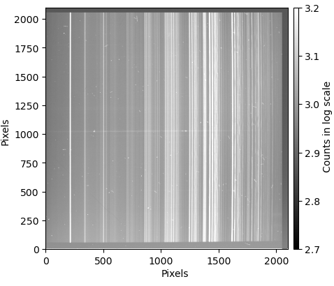

Data Cleaning
=============

The acquisition of photometric and spectroscopic data in astronomy is affected by various sources of noise. The major ones are:

* **Sensor Bias** – An electronic offset introduced by the detector. This is the image obtained when taking a zero-second exposure with the shutter closed. To correct for this, the **bias must be subtracted** from the data.

* **Dark Current** – Thermal noise present in non-refrigerated cameras. This image is obtained in exposures taken with the shutter closed for the same duration as the target observation. To remove this noise, the **dark frame must be subtracted** from the data.

* **Flat-Field Variations** – Pixel-to-pixel sensitivity differences in the light sensor. These variations can be measured by taking a short exposure (typically less than ten seconds) of a uniformly illuminated white screen inside the telescope dome (or using a sky-flat). After subtracting bias and dark frames, the 2D spectrum must be **divided by the flat-field** to correct for these inhomogeneities.

* **Cosmic-Ray Strikes** – Longer exposures accumulate more cosmic-ray hits. If multiple exposures of the same target are available, cosmic rays can be removed by taking the **median** of all exposures (avoid using the average). If only a few exposures are available, specialized algorithms can detect and remove cosmic rays by identifying their sharp edges.

A raw 2D spectrum with the dispersion axis aligned horizontally and affected by cosmic-ray strikes appears as follows:

  
  
In the ``easyspec`` `cleaning tutorial <https://github.com/ranieremenezes/easyspec/blob/main/tutorial/Image_cleaning_easyspec.ipynb>`_, we show how to clean a raw astronomical image. For the detaild documentation on the ``cleaning()`` class, we refer the reader to the `specitic cleaning documentation <https://easyspec.readthedocs.io/en/latest/easyspec.cleaning.html>`_.

.. note::

   The ``cleaning()`` class of ``easyspec`` can also be used to clean photometric data.

