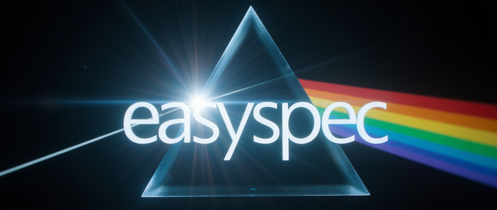

Welcome to easyspec's documentation!
====================================

  
Tutorials
---------

The instructions on how to use ``easyspec`` can be found in the GitHub directory "Tutorials".

The main tutorials are:

`Image_cleaning_easyspec <https://github.com/ranieremenezes/easyspec/blob/main/tutorial/Image_cleaning_easyspec.ipynb>`_: here we will guide you on how to reduce raw long-slit spectroscopic data, i.e., we will show you how to trim, debias, dedark, flatten, remove the cosmic rays, and stack the data.
`spectroscopy_tracing_easyspec <https://github.com/ranieremenezes/easyspec/blob/main/tutorial/spectroscopy_tracing_easyspec.ipynb>`_: here we will show you how to extract your spectra and calibrate them in wavelegnth and flux.
`spectral_analysis_easyspec <https://github.com/ranieremenezes/easyspec/blob/main/tutorial/spectral_analysis_easyspec.ipynb>`_: finally, we show you how to fit a model to each line of your spectrum with a MCMC approach and recover physical quantities such as redshift, dispersion velocity, FWHM, line flux and many more.

Contents
--------

.. toctree::

   Cleaning
