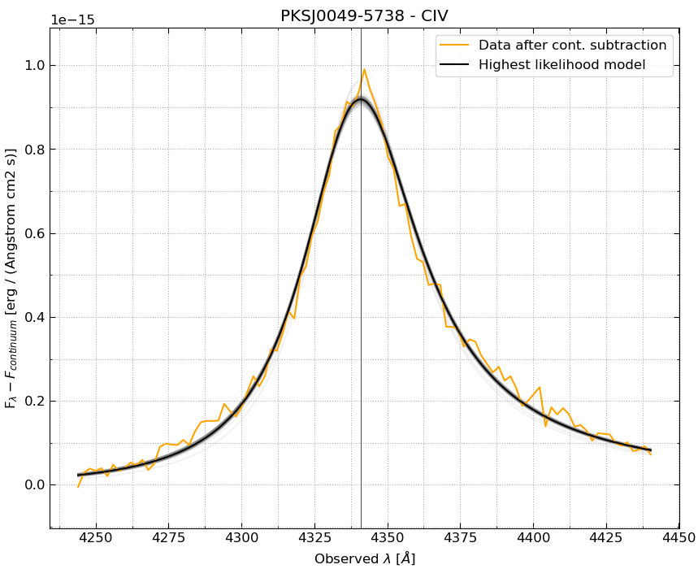

Line Models
===========

In ``easyspec``, we have a total of five line models available for fitting with the MCMC method. 

All models are defined in terms of the line flux after continuum subtraction, :math:`F_{\lambda}`.

.. contents:: Table of Contents
   :local:
   :depth: 2

Gaussian Model
--------------

The Gaussian profile is defined by:

.. math::
   :class: big-equation
   
   F_{\lambda} = A \exp\left(-\frac{(\lambda-\lambda_0)^2}{2\sigma^2}\right)

**Parameters to fit:**

* :math:`A` - Amplitude
* :math:`\lambda_0` - Mean wavelength (line center)
* :math:`\sigma` - Standard deviation

**Note:** The full width at half maximum (FWHM) is related to :math:`\sigma` by :math:`\mathrm{FWHM} = 2\sigma\sqrt{2\ln 2}`.

Lorentzian Model
----------------

The Lorentzian profile is defined by:

.. math::
   :class: big-equation
   
   F_{\lambda} = A \frac{\gamma^2}{(\lambda-\lambda_0)^2 + \gamma^2}

where :math:`\gamma = \mathrm{FWHM}/2` is the half-width at half-maximum.

**Parameters to fit:**

* :math:`A` - Amplitude
* :math:`\lambda_0` - Mean wavelength (line center)  
* :math:`\mathrm{FWHM}` - Full width at half maximum, i.e., :math:`2\gamma`.

**Note:** The peak value occurs at :math:`\lambda = \lambda_0` where :math:`F_{\lambda_0} = A`.

Voigt Model
-----------

The Voigt profile is a convolution of Gaussian and Lorentzian profiles, defined by:

.. math::
   :class: big-equation
   
   F_{\lambda} = A \cdot V(\lambda; \lambda_0, \sigma, \gamma)

where the Voigt function :math:`V` can be expressed as:

.. math::
   :class: big-equation
   
   V(\lambda; \lambda_0, \sigma, \gamma) = \int_{-\infty}^{\infty} G(\lambda'; \sigma) L(\lambda - \lambda'; \gamma)  d\lambda'

with :math:`G` being the Gaussian and :math:`L` the Lorentzian component.

**Parameters to fit:**

* :math:`A` - Amplitude
* :math:`\lambda_0` - Mean wavelength (line center)
* :math:`\sigma` - Gaussian standard deviation
* :math:`\gamma` - Lorentzian HWHM

Skewed Gaussian Model
---------------------

We start with the classical skewed Gaussian profile, defined by:

.. math::
   :class: big-equation
   
   F_{\lambda} = A \exp\left(-\frac{(\lambda-\lambda_0)^2}{2\sigma^2}\right) \left[1 + \mathrm{erf}\left(\alpha\frac{\lambda-\lambda_0}{\sigma\sqrt{2}}\right)\right]

**Where the parameters are:**

* :math:`A` - Amplitude
* :math:`\lambda_0` - represents the center of the symmetric Gaussian component but does not correspond exactly to the peak position when skewness is significant.
* :math:`\sigma` - Standard deviation
* :math:`\alpha` - Skewness parameter

**Note:** When :math:`\alpha = 0`, the profile reduces to a standard Gaussian.

**However**, we rewrite this classical form of the skewed Gaussian in terms of :math:`\lambda_{\mathrm{peak}}`, i.e., the position of the line peak in the wavelength axis. We do that by solving for the relationship between the symmetrical-Gaussian line center :math:`\lambda_0` and the actual peak position :math:`\lambda_{\mathrm{peak}}`.

The transformation is achieved through numerical root-finding. For a given skewness parameter :math:`s = \alpha/\sqrt{2}` and dimensionless variable :math:`x = (\lambda_0-\lambda)/\sigma`, we solve the equation:

.. math::
   :class: big-equation
   
   \frac{dF_{\lambda}}{dx} = -x [1 + \mathrm{erf}(s x)] + \frac{2s}{\sqrt{\pi}} e^{-s^2 x^2} = 0

using Brent's method. The solution :math:`x_{\mathrm{peak}}` gives us the offset between :math:`\lambda_0` and :math:`\lambda_{\mathrm{peak}}` through:

.. math::
   :class: big-equation
   
   \lambda_0 = \lambda_{\mathrm{peak}} - x_{\mathrm{peak}} \sigma

The final implemented model uses the parameters:

* :math:`\lambda_{\mathrm{peak}}` - Peak wavelength position (observed maximum)
* :math:`A` - Amplitude of the Gaussian symmetrical component
* :math:`\sigma` - Standard deviation
* :math:`\alpha` - Skewness parameter

This parameterization makes the fitting more physically intuitive, as :math:`\lambda_{\mathrm{peak}}` directly corresponds to the observable line peak.

Skewed Lorentzian Model
-----------------------

We start with the classical skewed Lorentzian profile, defined by:

.. math::
   :class: big-equation
   
   F_{\lambda} = A \frac{1 + \mathrm{erf}\left(\eta\frac{\lambda-\lambda_0}{\sqrt{2}\gamma}\right)}{1 + \frac{(\lambda-\lambda_0)^2}{\gamma^2}}

**Where the parameters are:**

* :math:`A` - Amplitude
* :math:`\lambda_0` - represents the center of the symmetric component but does not correspond exactly to the peak position when skewness is significant.
* :math:`\gamma` - Lorentzian HWHM
* :math:`\eta` - Skewness parameter

**Note:** When :math:`\eta = 0`, the profile reduces to a standard Lorentzian.

**However**, we rewrite this classical form of the skewed Lorentzian in terms of :math:`\lambda_{peak}`, i.e., the position of the line peak in the wavelength axis. We do that by solving for the relationship between the symmetrical-Lorentzian line center :math:`\lambda_0` and the actual peak position :math:`\lambda_{\mathrm{peak}}`.

The transformation is achieved through numerical root-finding. If we define :math:`s = \eta/\sqrt{2}` and :math:`x = \frac{\lambda-\lambda_0}{\gamma}`, the line peak occurs at :math:`\left.\frac{dF_{\lambda}}{dx}\right\vert_{x_{peak}} = 0`, which can be written as:

.. math::
   :class: big-equation
   
   \frac{s}{\sqrt{\pi}} e^{-s^2 x^2} (1 + x^2) - x[1 + \mathrm{erf}(s x)] = 0

The solution :math:`x_{\mathrm{peak}}` gives us the offset between :math:`\lambda_0` and :math:`\lambda_{\mathrm{peak}}` through:

.. math::
   :class: big-equation
   
   \lambda_0 = \lambda_{\mathrm{peak}} - x_{\mathrm{peak}} \gamma

The final implemented model uses the parameters:

* :math:`\lambda_{\mathrm{peak}}` - Peak wavelength position (observable maximum)
* :math:`A` - Amplitude of the Lorentzian symmetrical component
* :math:`\gamma` - Lorentzian HWHM  
* :math:`\eta` - Skewness parameter

This parameterization makes the fitting more physically intuitive, as :math:`\lambda_{\mathrm{peak}}` directly corresponds to the observable line peak. An example of a skewed Lorentzian profile applied to the CIV line of the AGN PKS J0049-5738 is shown below:

